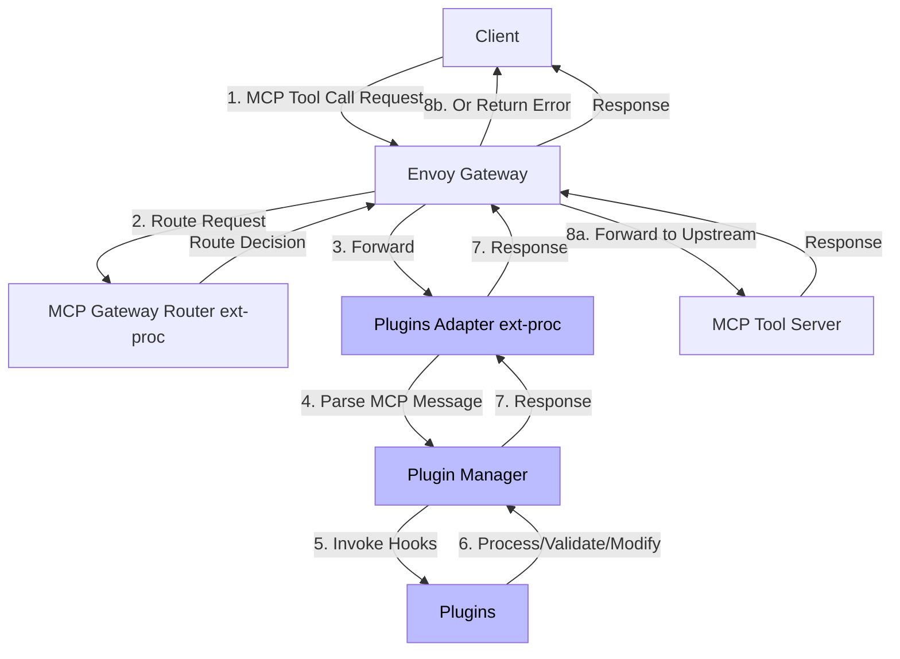

# Architecture

## Overview

The Plugins Adapter is currently implemented as an Envoy external processor (ext-proc) that provides a plugin framework for intercepting and processing Envoy messages.

## Plugin Adapter components

### External Processor Server
- gRPC server implementing Envoy's [external processor interface](https://www.envoyproxy.io/docs/envoy/latest/api-v3/extensions/filters/http/ext_proc/v3/ext_proc.proto)
- Intercepts HTTP requests/responses at various stages
- Invokes plugin manager with the appropriate hooks

### Plugin Manager
- Leveraged from the [ContextForge project](https://github.com/ibm/mcp-context-forge)
- Loads and initializes plugins from configuration
- Manages plugin lifecycle
- Coordinates hook invocations across plugins

Current hook points include but are not limited to:
- **Tool Pre-Invoke**: Before tool execution
- **Tool Post-Invoke**: After tool returns results
- **Prompt Pre-Fetch**: Before prompt retrieval

### Plugins

Plugins can be implemented and deployed in two ways:

#### Internal Plugins
- Deployed within the same container/pod as the plugin manager
- Loaded directly by the plugin manager
- Lower latency, simpler deployment
- Examples: Built-in validation, filtering, and transformation plugins

#### External Plugins
- Deployed as separate services
- Communicate via API conforming to the expected plugin interface (currently MCP)
- Greater isolation and independent scaling
- Can be written in any language
- Examples: External policy engines (OPA, Cedar), ML-based content moderation service

## Example Tool Request Flow

The [MCP gateway](https://github.com/Kuadrant/mcp-gateway) router is included to show the relationship with the ext-proc.

## System Architecture

Plugin adapter example with plugins

